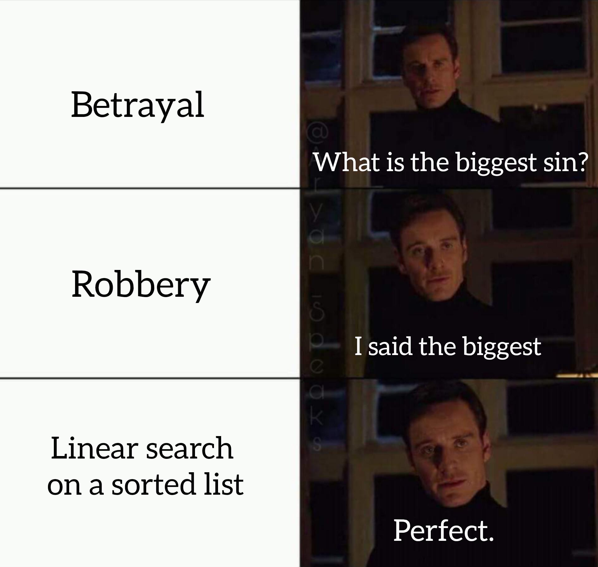
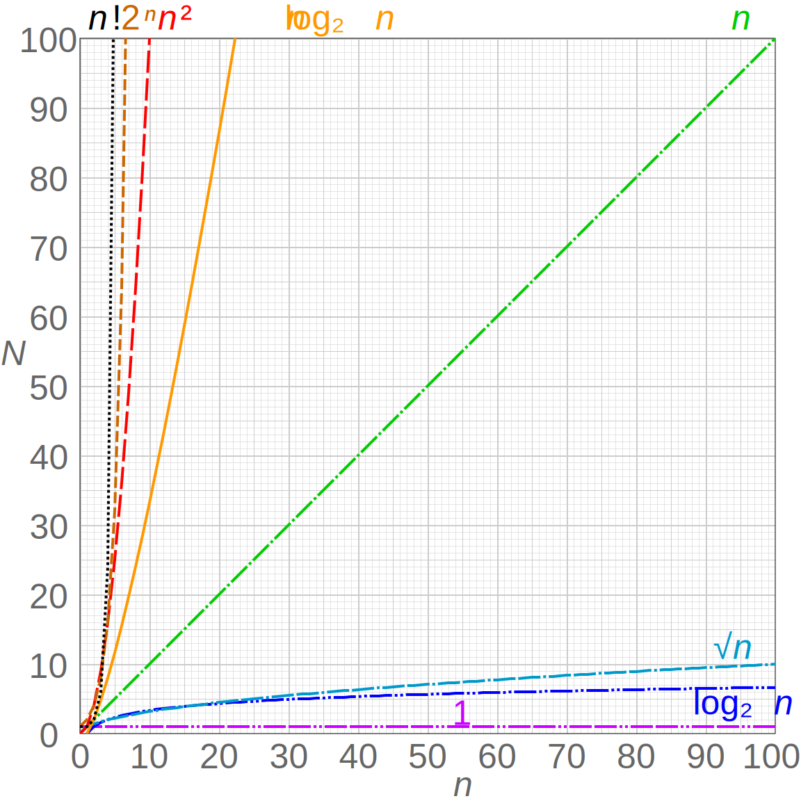
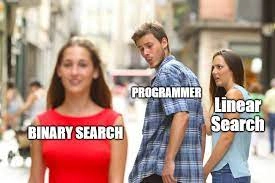
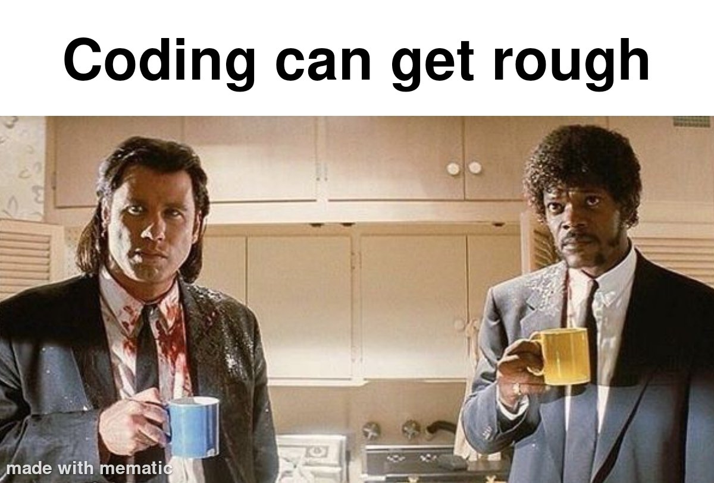

# [Binary Search](https://en.wikipedia.org/wiki/Binary_search)

The binary search algorithm.



&nbsp;

_Binary search_ is a faster way to find an item in a sorted array with **O(log n)** time complexity, compared to a regular loop with **O(n)** time complexity.

- An **\*efficient** way to find an _item_ in a sorted array

- **Divide and Conquer** approach

- [**Time Complexity**](https://en.wikipedia.org/wiki/Time_complexity) of `O(log n)`, **Logarithmic**

&nbsp;


&nbsp;

- `O(1)` **Constant**, \*_theBest_
- `O(n)` **Linear**, _Good_
- `O(n log n)` **Logarithmic**, _Fair_ Trade
- `O(n^2)` **Quadratic**, _Bad_
- `O(2^n)` **Exponential**, _Horrible_
- `O(n!)` **Factorial**, _Worst_

&nbsp;



&nbsp;

## Linear Search, `O(n!)`

```javascript
// normal search, O(n!)
function search(arr, target) {
  for (let i = 0; i < arr.length; i++) {
    if (arr[i] === target) {
      return i;
    }
  }
  return -1;
}
```

&nbsp;



&nbsp;

## `O(log n)`

```javascript
// lowerCased + sorted
theArray = someArray.map((value) => value.toLowerCase()).sort();

// binarySearch
function binarySearch(arr, target, start = 0, end = arr.length - 1) {
  let pointerIndex = Math.floor((start + end) / 2);
  let indexValue = arr[pointerIndex];
  // console.log(start, end, pointerIndex, indexValue)

  // failed
  if (start > end) {
    console.log("\nNot Found!!");
    return -1;
  }

  // found
  if (indexValue === target) {
    console.log(`${target} found at ${pointerIndex} :)`);
    return pointerIndex;
  }

  // overshoot
  if (indexValue > target) {
    return binarySearch(arr, target, start, pointerIndex - 1);
  }

  // undershoot
  if (indexValue < target) {
    return binarySearch(arr, target, pointerIndex + 1, end);
  }
}

console.log(binarySearch(theArray, "fml"));
```

`Note:` returns the index on the `sorted` array...

&nbsp;



`Note:` It's a lifelong journey...

&nbsp;

Until Next Time...✌️

&nbsp;
